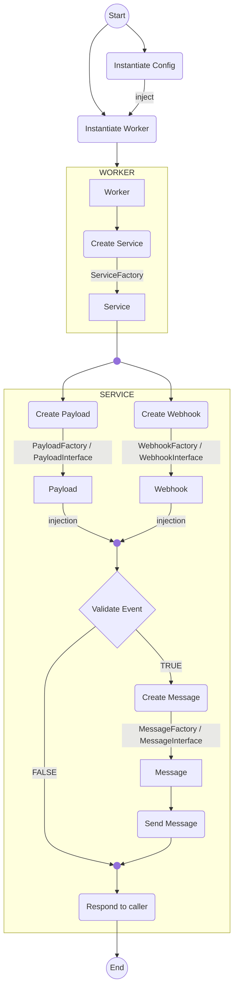

# Process

## 1: Worker initialization
The entire process by default is ran by a single `\tei187\GitDisWebhook\ValueObjects\Worker` instance, defined in `processCall()` method.

Worker is responsible for starting the process by detecting which webhook profile has been called and loading the configuration instance. Once this is done, a `makeService()` method is called, in order to create the appicable service instance, which will handle the webhook, payload and messages. This step will attempt to automatically set whether the service should be automatically detected, constrained to a pool of services or specified explicitly. After that, the worker will delegate the processing to the appropriate service instance.

## 2: Service creation
Service creation is handled by the `\tei187\GitDisWebhook\Factories\ServiceFactory` factory class. The factory will attempt to create the service based on the detection rules defined in the `config/services.php` configuration file, unless the service class to create is explicitly specified. If a matching service is found, it will be instantiated and returned to the worker.

### 2.1: Webhook profile assignment
After the service is created, the worker will call the `setWebhook()` method on the service instance, which uses `\tei187\GitDisWebhook\Factories\WebhookFactory` factory. This method is responsible for determining which webhook profile to use for the current request. The webhook profile is determined based on the detection rules defined in the `config/webhooks.php` configuration file. Once the appropriate webhook profile is identified, it is set on the service instance.

### 2.2: Payload handling
Next, the worker will call the `setPayload()` method on the service instance, which uses `\tei187\GitDisWebhook\Factories\PayloadFactory` factory. This method is responsible for determining which payload handler to use for the current request. The payload handler is determined based on the detection rules defined in the `config/payloads.php` configuration file. Once the appropriate payload handler is identified, it is set on the service instance.
This step is heavily dependent on the service used, as each service may have different requirements (JSON structure, event detection, payload adherence, etc).
There wre two separate ways of handling payloads within the service:
- **Automatic payload detection**: The service will attempt to automatically detect the appropriate payload handler based on the incoming request data and the detection rules defined by the service.
- **Explicit payload assignment**: The service may explicitly define which payload factory (or directly which payload) to use, bypassing the automatic detection process. This is useful for services that have a fixed payload structure or when specific handling is required.
The outcome payload will be dependable on which properties are defined by the service by default.

After the payload is set, it will be added to the service instance, as well as be injected to the webhook instance for further processing.

### 2.3 Payload validation
Before proceeding to message templating, the service will validate whether the received payload source (repository and branch, if any is applicable) and event is supported by the webhook profile. This is done by calling the `supportsService()` method on the injected webhook and `validateEvent()` method on the service instance. If the source or event are not supported, the process will be halted, and a response will be sent back to the caller indicating that the payload has been received but not processed due to restrictions in the webhook's configuration.

### 2.4: Message templating
Finally, the worker will call the `setMessage()` method on the service instance, which uses `\tei187\GitDisWebhook\Factories\MessageFactory` factory. This method is responsible for determining which message template to use for the current request. The message template is determined based on the detection rules defined in the `config/messages.php` configuration file, pointing to a specific event path. Once the appropriate message template is identified, it is set on the service instance.
Like with payload handling, message templating can be either automatically detected or explicitly assigned by the service.

## 3: Message dispatching
Once the service is fully configured with the webhook, payload, and message template, the worker will call the `send()` method on the message within the service instance. This method is responsible for sending the notification to the appropriate platform using the configured webhook.

## X: Responses
Application does respond in certain situations back to the caller. This is being handled by `\tei187\GitDisWebhook\Handlers\ResponsesHandler` static class, which is a simple ad hoc utility for managing HTTP responses in JSON format. Responses are limited to only certain situations, like successful payload reception, validation failures, unsupported services, etc. and do not cover internal errors of the script execution (wrong configuration, exceptions, wrong arguments, etc), which are expected to be handled by the server environment itself.
Responses are structured in a consistent JSON format, containing at least a `responseCode`, `type` and `message` fields.

## Workflow block diagram
